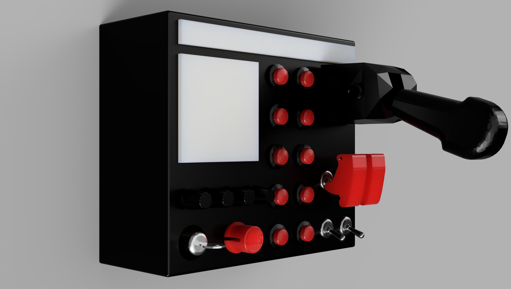

[🇧🇷 Português](README.md) | 🇺🇸 English

# ESP32-S3 SimHub Button Box



Open source sim racing button box (firmware + 3D-printed case): native USB
HID gamepad, WiFi + OTA, and a real integration with SimHub — the board
shows up in SimHub as a standard "Arduino" device, and **every light
effect is configured inside SimHub itself**, with zero game logic written
into the firmware.

## What this project is

A complete button box, from electronics to firmware, in two parts:

1. **Electronics + firmware** (this repository): an ESP32-S3 reads up to
   31 physical controls (buttons, encoders, ignition key, toggle
   switches, parking brake) and exposes them as a standard USB gamepad,
   while simultaneously speaking SimHub's real protocol over the same
   serial port to drive an 8x8 addressable LED matrix (e.g. flags/iFlag)
   and an LED strip (e.g. RPM).
2. **3D-printed case** (folder [`assets/`](assets)): the full physical
   enclosure, plus mounting points for third-party printable add-ons
   (parking brake handle, radio PTT button) — see below.

## Key features

- **Native HID** (USB-OTG/TinyUSB) — shows up as a gamepad on Windows
  with zero drivers, 32 buttons.
- **WiFi + OTA** — after the first USB flash, everything else is
  wireless.
- **SimHub's real Arduino protocol** — including the ARQ transport layer
  (checksum + per-packet acknowledgment) that the "Arduino" tab scanner
  in SimHub actually uses, not a simplified LED-only sketch.
- **RGB Matrix (8x8) + RGB Leds (strip)** — two separate logical devices
  for SimHub, wired as a single physical chain of addressable LEDs. No
  game logic in the firmware: SimHub decides the colors, the firmware
  just receives and lights them up.
- **Fully centralized, configurable pinout** — swapping ESP32 boards or
  reusing this project with a different pinout means editing a single
  file (see below).
- **No button matrix** — every input has its own channel/pin, favoring
  reliability and simple wiring over extreme GPIO economy.
- **Open source case** — 3D printed, with mounting points for
  third-party accessories.

## Electronics

| Component | Role |
|---|---|
| ESP32-S3 (any variant with native USB-OTG) | MCU — HID, WiFi, OTA, SimHub protocol |
| MCP23017 (I2C) | 11 push buttons, 3-position ignition key, Start Engine button |
| 74HC4067 (16-channel mux) | Encoder SW switches, 4 toggle switches, parking brake |
| 4× KY-040 encoder | CLK/DT wired directly to the MCU (interrupt-driven quadrature); SW through the mux |
| WS2812 8x8 matrix (64 LEDs) | SimHub's RGB Matrix — e.g. iFlag |
| WS2812 strip (~10 LEDs, configurable) | SimHub's RGB Leds — e.g. RPM |

## 3D-printed case

Everything is in [`assets/`](assets):

| File | Contents |
|---|---|
| `assets/STL/front.stl` | Front panel |
| `assets/STL/rear.stl` | Rear panel |
| `assets/STL/stand.stl` | Base/stand |
| `assets/STL/LED holder.stl` | LED matrix/strip mount |
| `assets/buttonbox.f3z` | Full editable Fusion 360 project (large file — see note below) |

> **Note on `buttonbox.f3z`**: this file is ~124 MB, above GitHub's 100 MB
> hard limit for a repo without Git LFS configured. It isn't tracked in
> this repo yet — if you need the editable Fusion 360 project, ask, or
> watch this repository for that to be resolved (Git LFS, or external
> hosting).

### Compatible third-party add-ons

These aren't mine — they're separate projects by other creators, designed
to bolt onto this button box. Download, print, and screw them directly
onto the case:

- **[DIY Parking Brake for Truck Simulators](https://www.printables.com/model/995554-diy-parking-brake-for-truck-simulators/files)**
  (Printables) — the physical lever that drives `INPUT_HANDBRAKE` (see
  [`docs/INPUTS_PINOUT.en.md`](docs/INPUTS_PINOUT.en.md) section 7 for how the
  firmware handles that signal).
- **Radio PTT button** — two options on Thingiverse:
  [thing:4740146](https://www.thingiverse.com/thing:4740146) and
  [thing:2928122](https://www.thingiverse.com/thing:2928122).

Check each model's own page for license and credit before using or
redistributing it.

## Why this can be reused on a different board/pinout

Every pin, channel, and address in this project lives in
**[`include/board_config.h`](include/board_config.h)** — it's the only
file that needs to change if you swap ESP32 boards (a bigger one, a
different variant) or just want different pins. No other `.cpp`/`.h` has
a loose pin number buried in the code.

Each component's driver (`lib/mcp23017`, `lib/mux4067`, `lib/encoders`,
`lib/ws2812`) is generic and keeps working standalone, outside this
project — each one accepts pin/address as a parameter and only falls back
to its own default when you don't pass anything.

## Architecture (overview)

```
                    ESP32-S3
                       │
        ┌──────────────┼───────────────┐
        │              │               │
       HID            CDC             WiFi
        │              │               │
        │           SimHub            OTA
        │              │
        │         RGB framebuffer
        │              │
        │              ▼
        │           WS2812 (matrix + strip, in series)
        │
        ▼
      INPUTS
        │
   ┌────┴─────────────┐
   │                  │
ESP32 GPIO         Expanders
(encoders)     ┌────┴────┐
               │         │
           MCP23017   74HC4067
               │         │
               └─────────┴── physical controls
```

Every arrow is an independent layer — none of them know the others'
logic (e.g. the WS2812 driver has no idea what RPM is; the SimHub parser
has no idea what a GPIO is). Full detail, including an audit of every
isolation rule, in
[`docs/SYSTEM_INTEGRATION.en.md`](docs/SYSTEM_INTEGRATION.en.md).

## How to build and flash

1. **WiFi credentials** (required, not committed):
   ```
   cp include/secrets.h.example include/secrets.h
   ```
   then edit `include/secrets.h` with your real WiFi network.

2. **Pinout** (only if your wiring differs from the default): edit
   [`include/board_config.h`](include/board_config.h).

3. **Build + flash over USB** (first time, or with no WiFi available):
   ```
   pio run -e esp32s3-supermini -t upload
   ```
   No button-holding needed — the firmware enters download mode on its
   own (see `scripts/enter_bootloader.py`).

4. **Flash over OTA** (after the first flash, once WiFi is configured):
   ```
   pio run -e ota -t upload
   ```

## How to test each part in isolation

Every hardware component has its own dedicated test firmware, with no
HID/WiFi/OTA/SimHub mixed in — flash it, wire up just that component, and
confirm it works before integrating everything:

| Env | Tests | Command |
|---|---|---|
| `mcp-test` | MCP23017 (16 inputs) | `pio run -e mcp-test -t upload -t monitor` |
| `mux-test` | 74HC4067 (configured channels) | `pio run -e mux-test -t upload -t monitor` |
| `encoder-test` | The 4 KY-040 encoders (CW/CCW) | `pio run -e encoder-test -t upload -t monitor` |
| `inputs-test` | Unified layer (all three together) | `pio run -e inputs-test -t upload -t monitor` |
| `ws2812-test` | Matrix + strip (color sweep) | `pio run -e ws2812-test -t upload -t monitor` |
| `simhub-test` | SimHub protocol in isolation | `pio run -e simhub-test -t upload` + `python scripts/simhub_test_send.py <port>` |
| `diag` | Minimal toolchain/board check (no HID) | `pio run -e diag -t upload -t monitor` |

If the full firmware (`esp32s3-supermini`) misbehaves, start by isolating
the suspect component's own test — it's faster to find the cause that way
than debugging everything at once.

## Serial console (CDC)

Besides the SimHub protocol, the same COM port accepts plain text
commands (any serial terminal, 115200 baud):

| Command | Effect |
|---|---|
| `PING` | replies `PONG` |
| `VERSION` | firmware version |
| `IP` | current network IP |
| `SETLEDS <n>` | sets how many LEDs the strip has (persisted in NVS) |
| `DUMPLEDS` | dumps what the matrix/strip framebuffers currently hold |
| `BOOTLOADER` | enters download mode in software (no BOOT button needed) |

## Full documentation

| File | Contents |
|---|---|
| [`docs/ARCHITECTURE.en.md`](docs/ARCHITECTURE.en.md) | USB (VID/PID/descriptors), HID, CDC, WiFi, OTA — how each baseline piece works |
| [`docs/BASELINE.en.md`](docs/BASELINE.en.md) | Tests that demonstrably passed, with evidence |
| [`docs/INPUTS_PINOUT.en.md`](docs/INPUTS_PINOUT.en.md) | Why each input went to the MCP23017/74HC4067/direct GPIO (the reasoning; current values live in `board_config.h`) |
| [`docs/SIMHUB_PROTOCOL.en.md`](docs/SIMHUB_PROTOCOL.en.md) | SimHub's real protocol (ARQ transport + commands), with the investigation's dead ends recorded on purpose |
| [`docs/SYSTEM_INTEGRATION.en.md`](docs/SYSTEM_INTEGRATION.en.md) | Final integration, cross-layer isolation audit, full test checklist |
| [`HANDOFF.en.md`](HANDOFF.en.md) | Project history (including the earlier STM32 attempt, abandoned due to counterfeit hardware) |

## Deliberately not implemented

- No game logic in the firmware (RPM, flags, shift light, pit limiter) —
  SimHub decides everything, the firmware just receives RGB and lights
  it up.
- SimHub's `SHCustomProtocol` — not used; the board shows up as a
  standard "Arduino" device, fully configurable from SimHub's own UI.
- Button matrix — every input has its own channel/pin.

## ☕ Support this project

If this project helped you or saved you time, you can support it:

- PicPay: **@orlandoeduardo.pereira**
- Link: https://picpay.me/orlandoeduardo.pereira
- Link (PicPay): https://link.picpay.com/p/177377918669b9b8f2b4e25

PIX QR Code (PicPay, Brazil's instant payment system):


